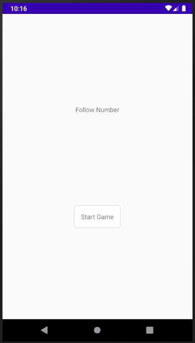

# Follow-Number

## 디자인 패턴 사용 (MVVM)

- `DataBinding`, `LiveData`를 사용하여 MVVM 디자인 패턴 사용
- 패키지 구조 나누는 연습 중

## 테스트 주도 개발 (TDD)

- TDD를 시도해봤으나 간단한 클래스까지는 가능했지만, M-V-VM 사이의 테스트는 연습이 더 필요할 것 같음

## 현재 진행상황
- [x] 숫자 누르면 사라짐
- [x] 9의 배수를 누르면 다음 세트로 화면 초기화
- [x] 정확한 숫자 누를 때마다 점수 1씩 증가

